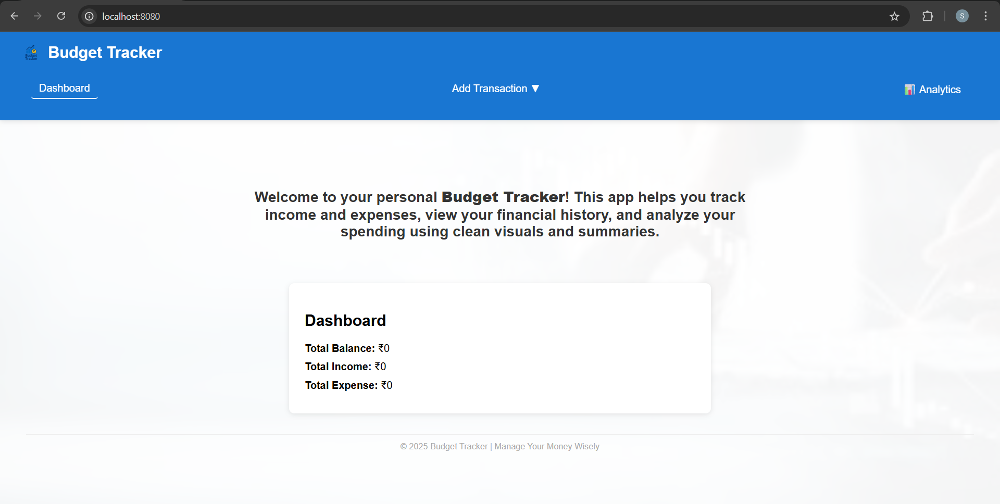
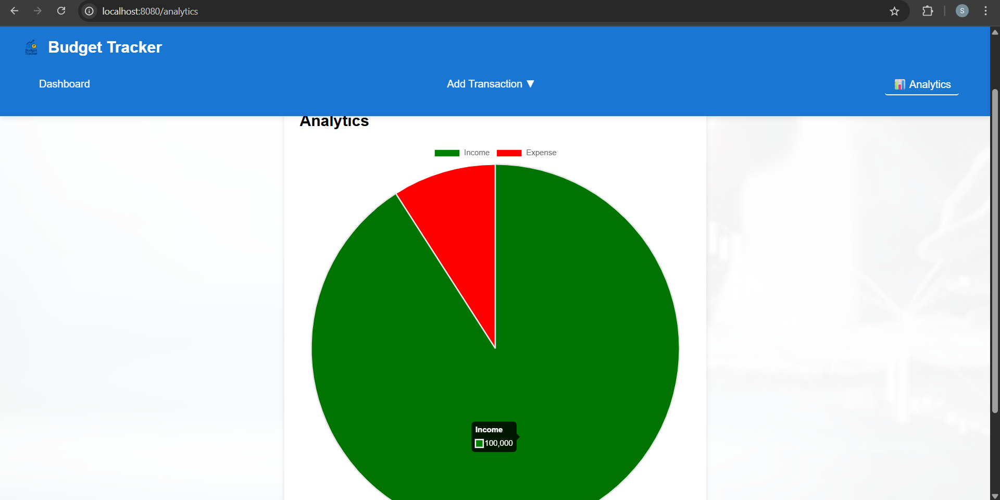
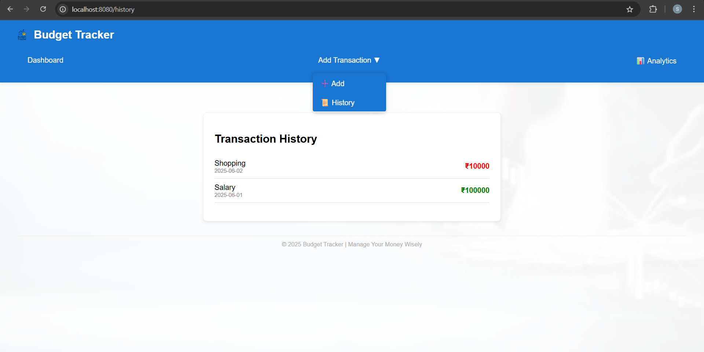

# budget-tracker-appn

## Project setup
```
npm install
```

### Compiles and hot-reloads for development
```
npm run serve
```

### Compiles and minifies for production
```
npm run build
```

### Customize configuration
See [Configuration Reference](https://cli.vuejs.org/config/).

## 📸 Application Screenshots

### 🏠 Dashboard


### ➕ Add Transaction


### ✅ Add Transaction Popup


### 📊 Analytics Page


### 📚 History Page


### 📱 Responsive View

